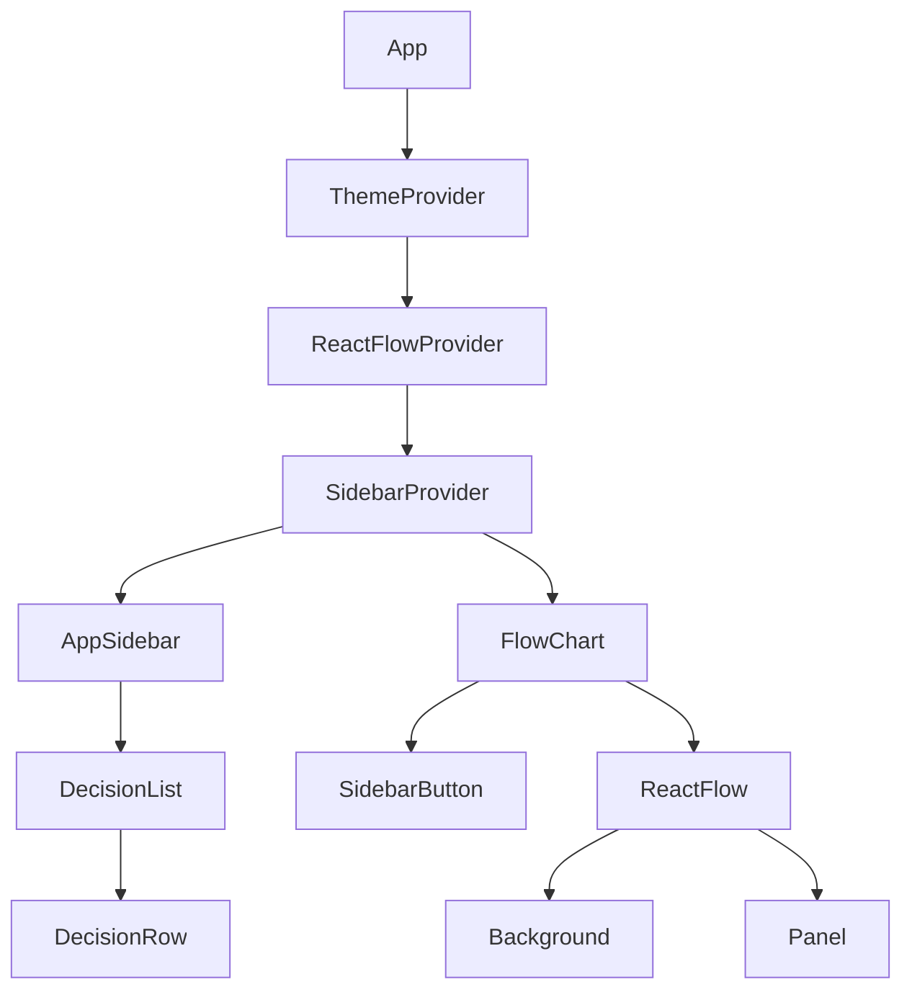
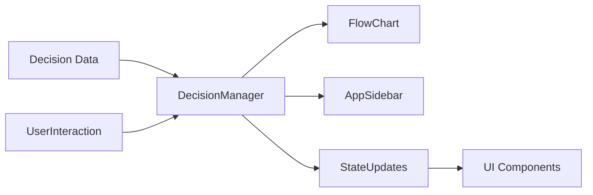

# System Patterns: Baldur's Gate 3 Decision Flowchart

## System Architecture

The BG3-Decision-Tree application follows a component-based architecture using React and TypeScript. The system is structured around the following key architectural patterns:

### Component Hierarchy

### Data Flow

## Key Technical Decisions

1. **React + TypeScript**: Using TypeScript for type safety and better developer experience
2. **ReactFlow**: Leveraging a specialized library for interactive node-based UIs
3. **Component-Based Design**: Breaking the UI into reusable, composable components
4. **Tailwind CSS**: Utilizing utility-first CSS for consistent styling
5. **Shadcn UI**: Using pre-built, customizable components based on Radix UI and Tailwind
6. **Radix UI**: Using accessible UI primitives for complex interactions
7. **Vite**: Fast build tooling and development server
8. **Storybook**: Component documentation and testing

## Design Patterns

### Component Patterns

1. **Compound Components**: Components that work together to form a cohesive unit (e.g., FlowChart and its children)
2. **Provider Pattern**: Context providers for theme, sidebar, and potentially decisions
3. **Controlled Components**: Managing component state through props and callbacks
4. **Custom Hooks**: Encapsulating reusable logic (e.g., useMobile)

### State Management Patterns

1. **React Context**: For global state that needs to be accessed by multiple components
2. **Local Component State**: For UI state specific to individual components
3. **Props Drilling**: For passing data down the component tree where appropriate
4. **Event Handlers**: For managing user interactions and state updates

### Data Patterns

1. **Type Definitions**: Clear interfaces for all data structures (Decision, DecisionOption, etc.)
2. **Data Normalization**: Organizing related data for efficient access and updates
3. **Immutable Updates**: Using immutable patterns for state updates
4. **Lazy Loading**: Loading data as needed to improve performance

## Component Relationships

### FlowChart Component

- **Purpose**: Main visualization component for the decision tree
- **Dependencies**: ReactFlow, Background, Panel
- **State**: Manages nodes, edges, and their relationships
- **Interactions**: Handles node placement, connections, and user interactions

### DecisionNode Component

- **Purpose**: Represents a single decision point in the game
- **Dependencies**: Card, Collapsible, ContextMenu, OptionBox
- **State**: Tracks open/closed state and selected option
- **Interactions**: Allows users to select options and view consequences

### AppSidebar Component

- **Purpose**: Provides access to available decisions and filters
- **Dependencies**: SidebarProvider, DecisionRow
- **State**: Manages sidebar visibility and selected filters
- **Interactions**: Allows dragging decisions to the canvas and filtering options

## Critical Implementation Paths

### Decision Tree Rendering

1. Load decision data from structured sources
2. Process relationships between decisions (prerequisites, unlocks)
3. Create initial node structure for ReactFlow
4. Render nodes and connections
5. Enable user interaction with nodes

### Decision Selection Flow

1. User selects a decision node
2. User chooses an option from available choices
3. System updates the decision state
4. System determines newly available or unavailable decisions
5. UI updates to reflect the new state (new nodes appear, some become unavailable)

### Data Management

1. Define clear type interfaces for all data structures
2. Organize decision data by acts and locations
3. Establish relationships between decisions (prerequisites, unlocks, mutual exclusivity)
4. Provide efficient access patterns for filtering and searching decisions

## Error Handling and Edge Cases

1. **Missing Data**: Graceful handling of incomplete decision data
2. **Circular Dependencies**: Detection and prevention of circular prerequisites
3. **Performance Optimization**: Strategies for handling large decision trees
4. **User Mistakes**: Support for undoing decisions and reorganizing the flowchart

## Future Architecture Considerations

1. **Persistence Layer**: Adding support for saving and loading flowcharts
2. **Backend Integration**: Potential for server-side storage and sharing
3. **Mobile Responsiveness**: Adapting the UI for smaller screens
4. **Offline Support**: Enabling offline usage with local storage
5. **Extensibility**: Architecture that supports adding new features and data
