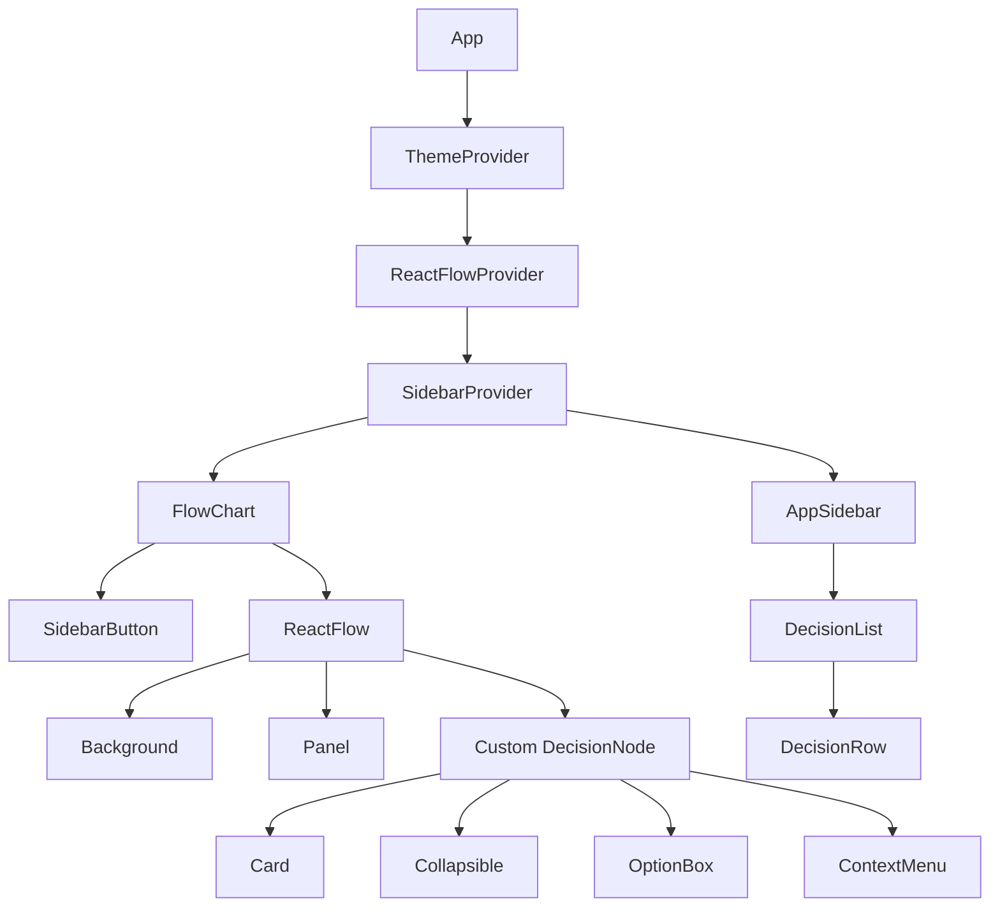
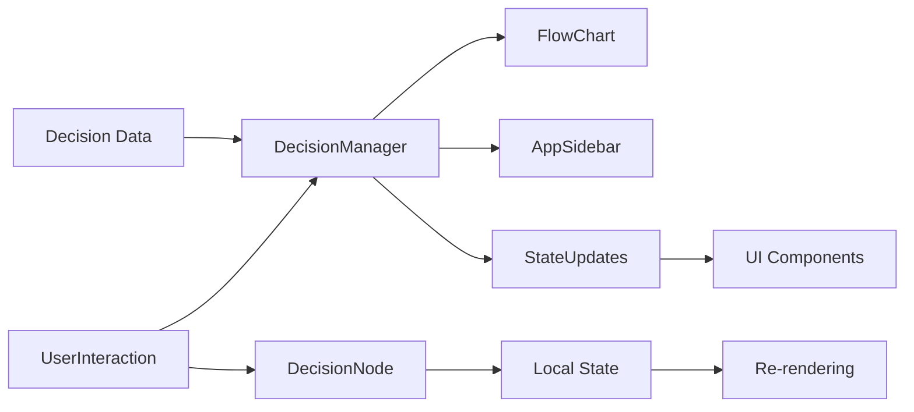
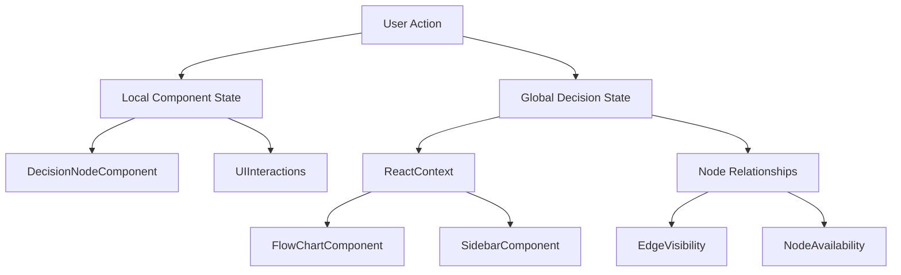

# System Patterns: Baldur's Gate 3 Decision Flowchart

## System Architecture

The BG3-Decision-Tree application follows a component-based architecture using React and TypeScript. The system is structured around the following key architectural patterns:

### Component Hierarchy

### Data Flow

### State Management

## Key Technical Decisions

1. **React + TypeScript**: Using TypeScript for type safety and better developer experience
2. **ReactFlow**: Leveraging a specialized library for interactive node-based UIs
3. **Component-Based Design**: Breaking the UI into reusable, composable components
4. **Tailwind CSS**: Utilizing utility-first CSS for consistent styling
5. **Shadcn UI**: Using pre-built, customizable components based on Radix UI and Tailwind
6. **Radix UI**: Using accessible UI primitives for complex interactions
7. **Vite**: Fast build tooling and development server
8. **Storybook**: Component documentation and testing
9. **Local Component State**: Managing UI state within components
10. **Context API**: Using React Context for global state management

## Design Patterns

### Component Patterns

1. **Compound Components**: Components that work together to form a cohesive unit (e.g., FlowChart and its children)
2. **Provider Pattern**: Context providers for theme, sidebar, and potentially decisions
3. **Controlled Components**: Managing component state through props and callbacks
4. **Custom Hooks**: Encapsulating reusable logic (e.g., useMobile)
5. **Component Composition**: Building complex UI from simpler components
6. **Render Props**: Using children as a function to customize rendering

### State Management Patterns

1. **React Context**: For global state that needs to be accessed by multiple components
2. **Local Component State**: For UI state specific to individual components
3. **Props Drilling**: For passing data down the component tree where appropriate
4. **Event Handlers**: For managing user interactions and state updates
5. **Immutable Updates**: Using immutable patterns for state updates
6. **State Lifting**: Moving state up to common ancestors when needed

### Data Patterns

1. **Type Definitions**: Clear interfaces for all data structures (Decision, DecisionOption, etc.)
2. **Data Normalization**: Organizing related data for efficient access and updates
3. **Immutable Updates**: Using immutable patterns for state updates
4. **Lazy Loading**: Loading data as needed to improve performance
5. **Structured Data Organization**: Organizing by acts, regions, and locations

## Component Relationships

### FlowChart Component

- **Purpose**: Main visualization component for the decision tree
- **Dependencies**:
  - ReactFlow: For node-based UI rendering
  - Background: For visual grid
  - Panel: For UI controls positioning
  - SidebarButton: For toggling sidebar
- **State**:
  - Currently empty nodes and edges arrays
  - Empty handlers for node/edge changes and connections
- **Interactions**:
  - Will handle node placement, connections, and user interactions
  - Currently configured with zoom controls (0.1 to 2x)
  - Attribution hidden via proOptions

### DecisionNode Component

- **Purpose**: Represents a single decision point in the game
- **Dependencies**:
  - Card: Container for visual styling
  - CardTitle: For decision description
  - CardContent: For content layout
  - Collapsible: For expanding/collapsing options
  - ContextMenu: For additional actions
  - OptionBox: For displaying decision options
- **State**:
  - Tracks open/closed state with React.useState
  - Tracks selected option with React.useState
- **Interactions**:
  - Allows users to select options via handleClick function
  - Provides context menu for undoing decisions and deletion
  - Changes border color based on selection state
  - Shows/hides options via collapsible component

### AppSidebar Component

- **Purpose**: Provides access to available decisions and filters
- **Dependencies**:
  - SidebarProvider: For sidebar visibility state
  - DecisionRow: For individual decision items
- **State**:
  - Manages sidebar visibility (through context)
  - Will manage filters and selected decisions
- **Interactions**:
  - Will allow dragging decisions to the canvas
  - Will provide filtering options
  - Current implementation details pending further development

### OptionBox Component

- **Purpose**: Visual representation of decision options
- **Dependencies**:
  - Button or similar base component
- **State**:
  - Receives variant and onClick props for customization
- **Interactions**:
  - Handles click events for option selection
  - Visual styling based on variant (e.g., destructive for removal)

## Critical Implementation Paths

### Decision Tree Rendering

1. Load decision data from structured sources (acts/, characters/, decisions/)
2. Process relationships between decisions (prerequisites, unlocks)
3. Create initial node structure for ReactFlow
4. Render nodes and connections
5. Enable user interaction with nodes

### Decision Selection Flow

1. User selects a decision node
2. User chooses an option from available choices
3. System updates the decision state:
   - Currently local to DecisionNode component
   - Will be integrated with global state
4. System determines newly available or unavailable decisions
5. UI updates to reflect the new state:
   - Currently changes border color
   - Future: new nodes appear, some become unavailable

### ReactFlow Integration

1. Setup ReactFlow with configuration options
2. Define custom node types mapped to DecisionNode
3. Create data structures for nodes and edges
4. Implement node positioning and layout algorithms
5. Implement interaction handlers:
   - onNodesChange
   - onEdgesChange
   - onConnect

### Data Management

1. Define clear type interfaces for all data structures
2. Organize decision data by acts and locations
3. Establish relationships between decisions (prerequisites, unlocks, mutual exclusivity)
4. Provide efficient access patterns for filtering and searching decisions
5. Create a central store for decision state

## Error Handling and Edge Cases

1. **Missing Data**: Graceful handling of incomplete decision data
2. **Circular Dependencies**: Detection and prevention of circular prerequisites
3. **Performance Optimization**: Strategies for handling large decision trees
4. **User Mistakes**: Support for undoing decisions and reorganizing the flowchart
5. **Empty State**: Handling first-time usage with empty flowchart
6. **Invalid Selections**: Preventing selection of mutually exclusive options

## Future Architecture Considerations

1. **Global State Management**:

   - Consider implementing a more robust state management solution
   - Options include Context API with useReducer, Redux, or Zustand
   - Need to handle complex state relationships between decisions

2. **Persistence Layer**:

   - Adding support for saving and loading flowcharts
   - Local storage for client-side persistence
   - Potential for server-side storage in the future

3. **Performance Optimization**:

   - Virtualization for large decision trees
   - Efficient re-rendering strategies
   - Memoization of expensive calculations

4. **Mobile Responsiveness**:

   - Adapting the UI for smaller screens
   - Specialized touch interactions
   - Simplified view for limited screen real estate

5. **Extensibility**:

   - Architecture that supports adding new features
   - Pluggable system for different game data
   - API abstraction for potential backend integration

6. **Advanced Node Management**:
   - Auto-layout algorithms for complex flowcharts
   - Grouping and folding for related decisions
   - Multi-select and bulk operations
